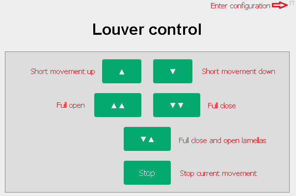
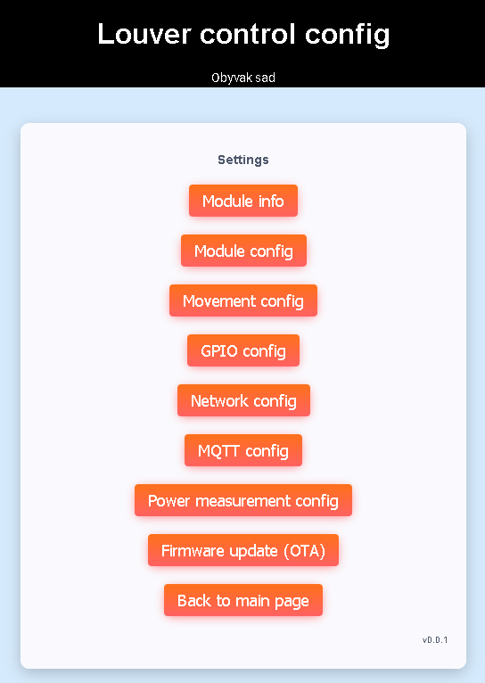

# Louver control for ESP based devices
This contains a firmware for louver control for Tasmota-compatible ESP based devices like Sonoff DUAL R3,
Shelly 2PM or Athom KM01. It was created because I was not satisfied with Tasmota configuration 
specific to louvers (not the same as blinds and curtains). Louvers require specific control of lamellas.

## Why should I use it rather than Tasmota
 - Lightweight and responsive
 - User friendly - easy to setup
 - Power measurement can be used as end switches and stop long movements
 - MQTT remote control
 - It just works!
 
## Howto & configuration
[Release notes](doc/release_notes.md)

[Quick setup tutorial](doc/quick_setup.md)
  
[How to build](doc/build.md)

[Module info](doc/module_info.md)

[Module config](doc/module_config.md)

[Movement config](doc/movement_config.md)

[GPIO config](doc/gpio_config.md)

[Network config](doc/network_config.md)

[MQTT config and usage](doc/mqtt_config.md)

[Power measurement config](doc/power_meas_config.md)

## Function description
There are 3 GPIO buttons:
 - key up
 - key down
 - reset

And 2 GPIO relays:
 - motor up
 - motor down

Supported movements executed by key press:
 - Short key press controls relays directly
 - Long press (more than 2 seconds) makes louver to fully open/close (time can be configured).
 - Sequential press of down and then up (while holding down) key makes louver to fully close and open lamellas.

5 second long press of reset button causes loading defaults and module reboot to AP mode.

There is also web interface to control louver and configure firmware.

## Web interface

## Supported devices
 - ESP8266
 - ESP32
 
## What is implemented
 - AP and client mode
 - Web interface
 - MQTT
 - Power measurement (just BL0939 and ADE7953 for now)
 - Captive portal
 - OTA firmware update
 - mDNS for friendly access (xxx.local instead of IP)
 - Telnet logging
 
## MQTT
Following subscribe topics are implemented:
 - CLIENT_ID/movement
 
Following publish topics are implemented:
 - CLIENT_ID/movement/status
 - CLIENT_ID/key/up
 - CLIENT_ID/key/down
 - CLIENT_ID/power_meas/[depends on driver]

See [MQTT config and usage](doc/mqtt_config.md) for details. 

## Important notes
This project is under heavy development and it's still not finished.

To do:
 - Export / import configuration

 

