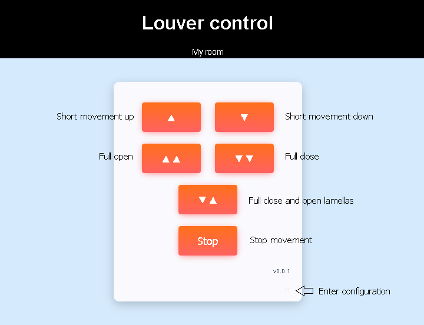

# Louver control for ESP based devices
This contains a firmware for louver control for Tasmota-compatible ESP based devices like Sonoff DUAL R3. It was created because I was not satisfied with Tasmota configuration specific to louvers (not the same as blinds and curtains). Louvers require specific control of lamellas.

## Function description
There are 3 GPIO buttons:
 - key up
 - key down
 - reset

And 2 GPIO relays:
 - motor up
 - motor down

Short key press controls relays directly, long press (more than 2 seconds) makes louver to fully open/close (time can be configured).

5 second long press of reset button causes loading defaults and module reboot to AP mode.

There is also web interface to control louver and configure firmware.

## Web interface

## Supported devices
 - ESP8266
 - ESP32
 
## What is implemented
 - AP and client mode
 - Web interface
 - MQTT
 - Power measurement (just BL0939 for now)
 - Captive portal
 - OTA firmware update
 - mDNS for friendly access (xxx.local instead of IP)
 - Telnet logging
 
## MQTT
Following topics are implemented:
 - CLIENT_ID/movement
 
### CLIENT_ID/movement
String values:
 - up - short open movement
 - down - short close movement
 - open - full open movement
 - close - full close movement
 - close_open_lamellas - full close and open lamellas movement

## Documentation  
[How to build](doc/build.md)

[Module info](doc/module_info.md)

[Module config](doc/module_config.md)

## Important notes
This project is under heavy development and it's still not finished.

To do:
 - Export / import configuration
 

