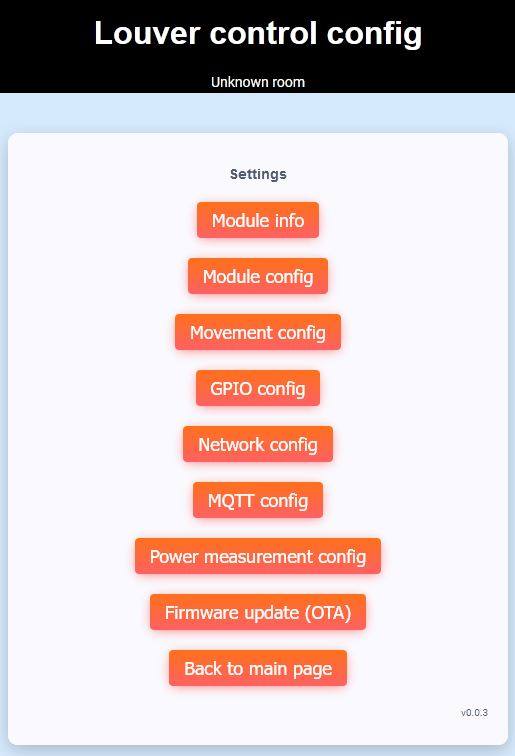

# Louver control for ESP based devices
This contains a firmware for louver control for Tasmota-compatible ESP based devices like Sonoff DUAL R3. It was created because I was not satisfied with Tasmota configuration specific to louvers (not the same as blinds and curtains). Louvers require specific control of lamellas.

## Function description
There are 2 GPIO buttons:
 - key up
 - key down

And 2 GPIO relays:
 - motor up
 - motor down

Short key press controls relays directly, long press (more than 2 seconds) makes louver to fully open/close (time can be configured).

There is also web interface to control louver and configure firmware.

## Web interface

## Supported devices
 - ESP8266
 - ESP32
 
## What is implemented
 - AP and client mode
 - Web interface
 - Captive server
 - OTA firmware update
 - mDNS for friendly access (xxx.local instead of IP) 
  
## Dependencies
 - ESPAsyncWebSrv
 - FS
 - WiFi
 - AsyncTCP
 - AsyncElegantOTA
 - DNSServer
 - ArduinoJson
 - EEPROM
 - StreamUtils
 - ESPmDNS
 - ESPDateTime

## How to build
This project can be build using Arduino IDE with installed dependencies (listed above).

