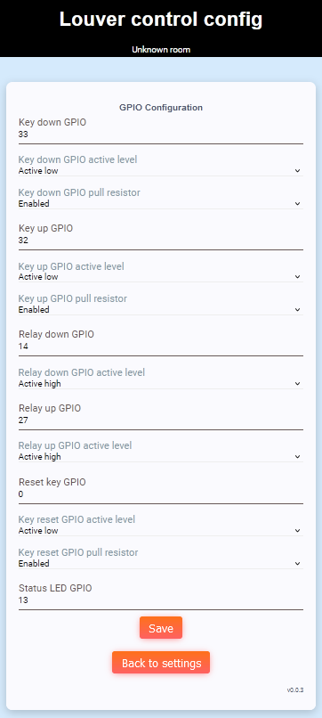

# GPIO config
GPIO config page provides switch and relay GPIO configuration.

## Key down GPIO, Key up GPIO, Relay down GPIO, Relay up GPIO, Reset key GPIO
GPIO pin index to be used

## Key down GPIO active level, Key up GPIO active level,  Relay down GPIO active level,  Relay up GPIO active level, Reset key GPIO active level
Active level for GPIO

## Key down GPIO pull resistor, Key up GPIO pull resistor, Key reset GPIO pull resistor
Enable/disable pull resistor for GPIO input

[Main page](../README.md)
