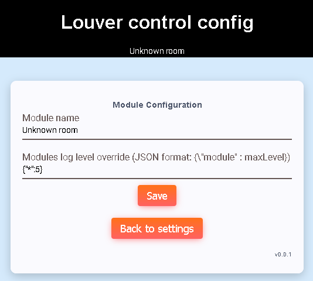

# Module config
Module config page provides basic module configuration.



## Module name
Module name is friendly module name shown at the top of web interface

## Module logging
Module logging config provides ability to configure maximal log level for particular
modules.

Log levels:
 - 0 = error
 - 1 = warning
 - 2 = info
 - 3 = debug
 - 4 = verbose
 
Default log level is set to 2 for all modules.

Configuration string format (JSON):
```
{"module1":level, "module2":level}
``` 

Supported modules:
 - * = all modules (default log level)
 - ADE7953
 - BL0939
 - Config
 - HTTP
 - Log
 - Louver
 - MDNS
 - Module
 - MQTT
 - PowerMeas
 
Example (sets default log level to debug, BL0939 log level to verbose):
```
{"*":3,"BL0939":4}
```

[Main page](../README.md)
