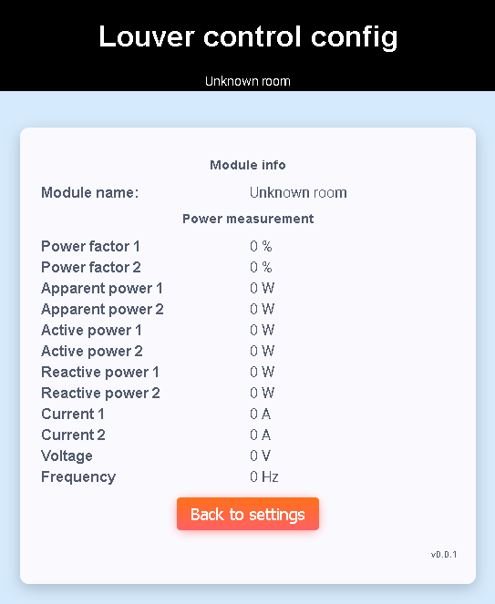

# Module info
Module info page shows basic module configuration with power measurement info

There is no power measurement info available when disabled or error in configuration.

[Main page](../README.md)
[Module configuration](module_config.md)