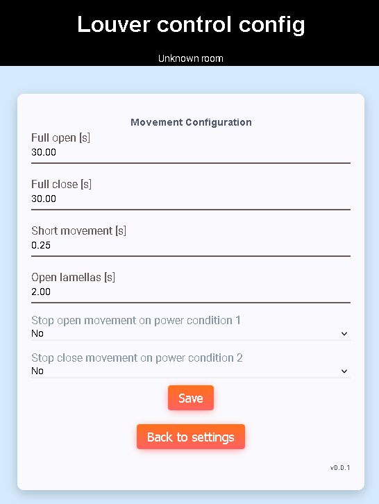

# Movement config
Movement config page provides louver movement configuration.

## Full open
Time in seconds to fully open louver.

## Full close
Time in seconds to fully close louver.

## Short movement
Time in seconds for short louver movement (open/close) used by MQTT.

## Open lamellas
Time in seconds for opening lamellas (after full close).

## Stop movement on power condition
Full open, full close and full close movements can be terminated when power 
condition is met. This is simulation of end-switch.
There is separate condition for open and close movement (dual relay module
with power measurement).

[Main page](../README.md)
