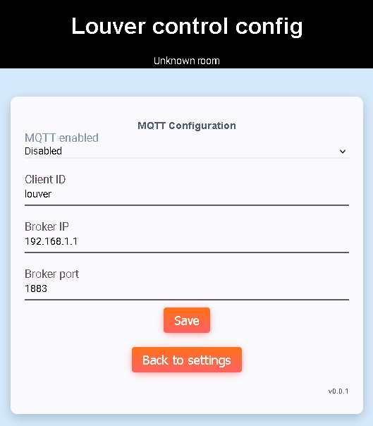

# MQTT config
MQTT config page provides module MQTT configuration.

## MQTT enabled
Enable or disable MQTT

## Client ID
MQTT client ID to be used to connect to broker

## Broker IP
MQTT broker IP

## Broker port
MQTT broker port

[Main page](../README.md)
