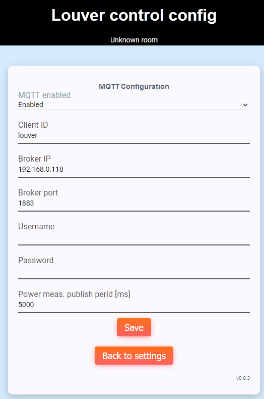

# MQTT config and usage

## Config page
MQTT config page provides module MQTT configuration.



### MQTT enabled
Enable or disable MQTT

### Client ID
MQTT client ID to be used to connect to broker

### Broker IP
MQTT broker IP

### Broker port
MQTT broker port

### Username
Username to be used to connect to MQTT broker

### Password
Password to be used to connect to MQTT broker

### Power meas. publish period
Power measurement topics publish perion in milliseconds (1000 is minimum)

## Usage
### Subscribe topics
Following subscribe topics are implemented:
 - CLIENT_ID/movement
 
#### CLIENT_ID/movement
Performs louver movement. Following values are supported:
 - up - short open movement
 - down - short close movement
 - open - full open movement
 - close - full close movement
 - close_open_lamellas - full close and open lamellas movement
 - stop - stop actual movement
 
mosquitto example:
```
mosquitto_pub.exe -t "louver/movement" -m "down"
```

### Publish topics
Following publish topics are implemented:
 - CLIENT_ID/movement/status
 - CLIENT_ID/movement/position
 - CLIENT_ID/key/up
 - CLIENT_ID/key/down
 - CLIENT_ID/power_meas/[depends on driver] - see below
 
#### CLIENT_ID/movement/status
Current louver movement status. Following values are reported:
 - stop - no movement
 - up - short open movement
 - down - short close movement
 - open - full open movement
 - close - full close movement
 - close_open_lamellas - full close and open lamellas movement

#### CLIENT_ID/movement/position
Current louver position in percents. Default value is 0 after reboot.
 
#### CLIENT_ID/key/up and CLIENT_ID/key/down
Key press status. Following values are reported:
 - active - key pressed
 - inactive - key released
 - hold - key long pressed
 
#### CLIENT_ID/power_meas/[depends on driver]
These topics are used by power measurement. You can configure publish period.
Topic list is dependent on driver. Values are float converted to string.

There is also JSON formatted output since FW version 0.0.4.

##### Topics for BL0939
 - power_meas/voltage
 - power_meas/current1
 - power_meas/current2
 - power_meas/power1
 - power_meas/power2
 - power_meas/energy1
 - power_meas/energy2
 - power_meas/total_energy

##### JSON iterable topics
There are JSON iterable topics published since FW version 0.0.4. Total power measurement
topics count can be obtained from topic power_meas/count

JSON power meas topic names are power_meas/[INDEX] where INDEX is 0 to power_meas/count-1

Each topic has following format (example):
```
{ "description":"Voltage RMS","mqtt":"voltage","unit":"V","format":".0f","value":246.99}
```

Example topic values for BL0939:
```
power_meas/count = 8
power_meas/0 = { "description":"Voltage RMS","mqtt":"voltage","unit":"V","format":".0f","value":246.48}
power_meas/1 = { "description":"Current 1 RMS","mqtt":"current1","unit":"A","format":".3f","value":0.00}
power_meas/2 = { "description":"Current 2 RMS","mqtt":"current2","unit":"A","format":".3f","value":0.00}
power_meas/3 = { "description":"Power 1","mqtt":"power1","unit":"W","format":".3f","value":0.00}
power_meas/4 = { "description":"Power 2","mqtt":"power2","unit":"W","format":".3f","value":0.00}
power_meas/5 = { "description":"Energy 1","mqtt":"energy1","unit":"Wh","format":".0f","value":0.00}
power_meas/6 = { "description":"Energy 2","mqtt":"energy2","unit":"Wh","format":".0f","value":0.00}
power_meas/7 = { "description":"Total energy","mqtt":"total_energy","unit":"Wh","format":".0f","value":0.00}
```

[Main page](../README.md)
