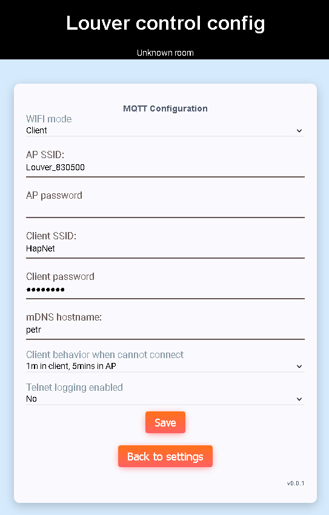

# Network config
Network config page provides module network configuration.

## WIFI mode
WIFI mode:
 - AP = access point mode
 - Client = client mode

## AP SSID
Access point mode SSID

## AP password
Access point mode password

## Client SSID
SSID to connect to

## Client password
Password to be used to connect to AP in client mode

## mDNS host name
Multicast DNS host name to be used. Web interface can be accessed by entering
host_name.local to browser

## Client behavior when cannot connect
There are two modes how module acts when it is unable to connect to AP in client
mode:
 - 1m in client, 5mins in AP = 1 minute trying to connect to AP, then it switches to AP mode for 5 minutes (and repeats)
 - Permanent client = still trying to connect to configured AP
 
## Teltet logging enabled
It is possible to enable log offloading via telnet

[Main page](../README.md)
