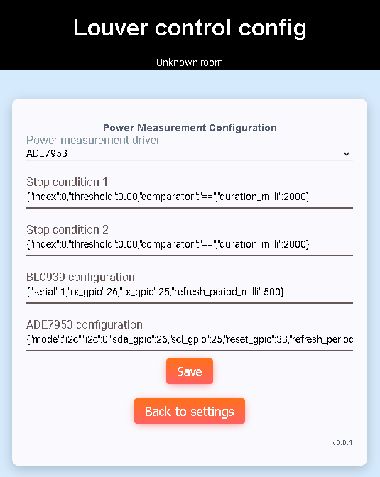

# Power measurement config
Power measurement config page provides power measurement driver configuration.
Power measurement conditions can be used to stop louver movements.



## Power measurement driver
Driver to be used to measure power. Following drivers are supported:
 - Disabled = Power measurement disabled
 - BL0939 (UART)
 - ADE7953 (I2C or UART)

## Stop condition 1
Full open movement condition. Full open movement is stopped when power condition 1
is satisfied.

Format (JSON):
```json
{"index":0,"threshold":0.00,"comparator":"==","duration_milli":2000}
```

Where:
 - index is power measurement value index as listed in Module info page (starting from 0)
 - threshold is threshold compare value
 - comparator is comparator to be used to compare threshold with measured value. Following is supported:
   - "=="
   - "<"
   - "<="
   - ">"
   - ">="
   - "!="
 - duration_milli is a time for which comparison must be true to satisfy condition (in milliseconds)
 
## Stop condition 2
Full close movement condition. Full close movement is stopped when power condition 2
is satisfied.

Format (JSON):
```json
{"index":0,"threshold":0.00,"comparator":"==","duration_milli":2000}
```

Where:
 - index is power measurement value index as listed in Module info page (starting from 0)
 - threshold is threshold compare value
 - comparator is comparator to be used to compare threshold with measured value. Following is supported:
   - "=="
   - "<"
   - "<="
   - ">"
   - ">="
   - "!="
 - duration_milli is a time for which comparison must be true to satisfy condition (in milliseconds)
 
## BL0939 configuration
BL0939 driver configuration string.

Format (JSON):
```json
{"serial":1,"rx_gpio":26,"tx_gpio":25,"refresh_period_milli":500}
```

Where:
 - serial is UART peripheral index (0 = UART0, 1 = UART1, ...)
 - rx_gpio is RX pin GPIO index
 - tx_gpio is TX pin GPIO index
 - refresh_period_milli is power measurement value update period in milliseconds
 
## ADE7953 configuration
ADE7953 driver configuration string. Two modes are supported (specified by "mode" JSON value):
 - I2C
 - UART

### I2C mode
Config format (JSON):
```json
{"mode":"i2c","i2c":0,"sda_gpio":26,"scl_gpio":25,"reset_gpio":33,"refresh_period_milli":500}
```

Where:
 - mode is driver mode (i2c or uart)
 - i2c is I2C peripheral index (0 = I2C0, 1 = I2C1, ...)
 - sda_gpio is SDA pin GPIO index
 - scl_gpio is SCL pin GPIO index
 - reset_gpio is RESET pin GPIO index
 - refresh_period_milli is power measurement value update period in milliseconds
 
### UART mode (untested)
Config format (JSON):
```json
{"mode":"uart","serial":0,"rx_gpio":26,"tx_gpio":25,"reset_gpio":33,"refresh_period_milli":500}
```

Where:
 - mode is driver mode (i2c or uart)
 - serial is UART peripheral index (0 = UART0, 1 = UART1, ...)
 - rx_gpio is RX pin GPIO index
 - tx_gpio is TX pin GPIO index
 - reset_gpio is RESET pin GPIO index
 - refresh_period_milli is power measurement value update period in milliseconds

[Main page](../README.md)
